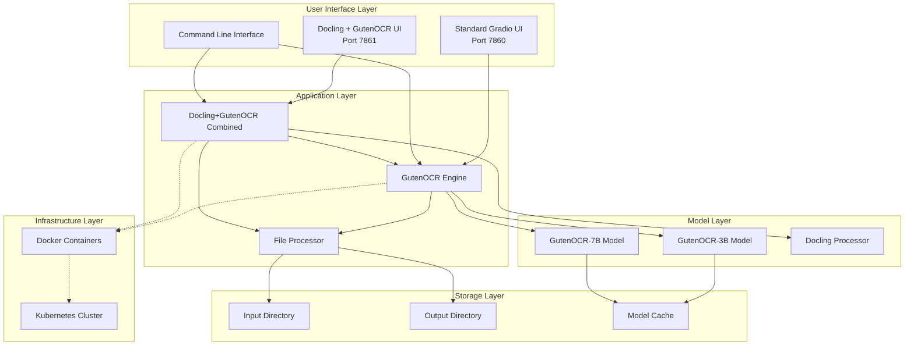
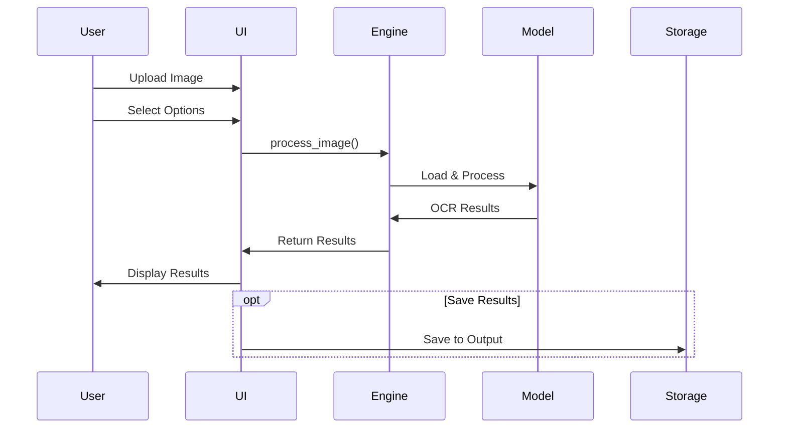
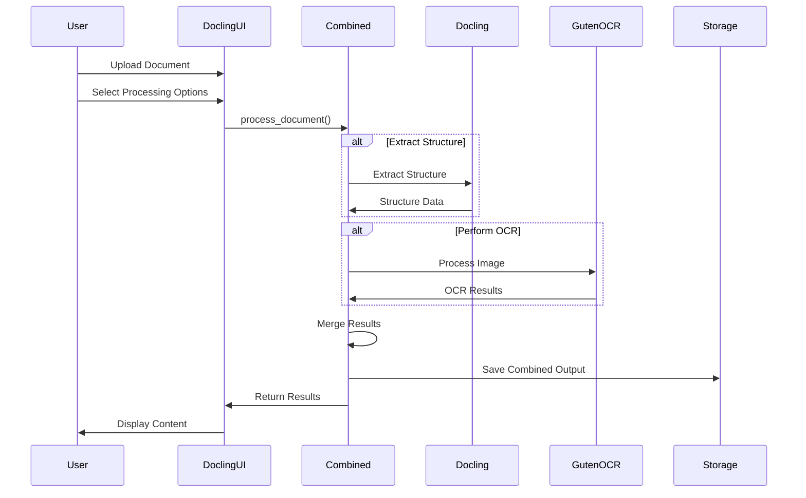
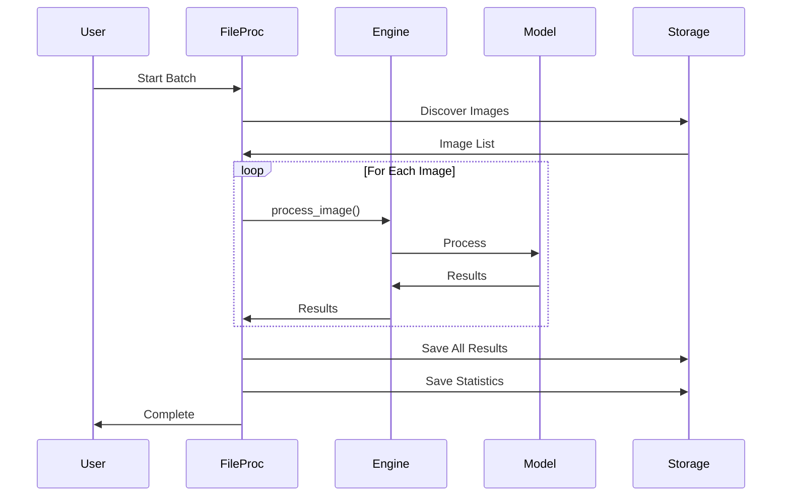
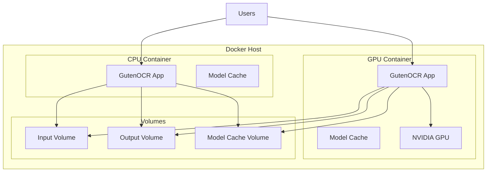
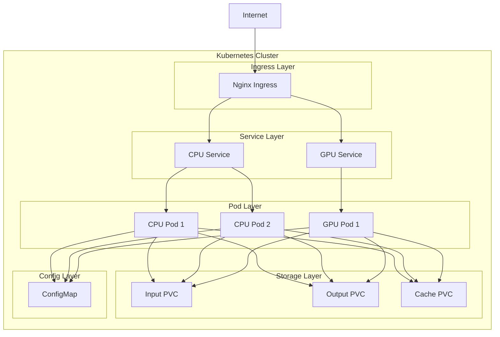

# GutenOCR Application Architecture

## Overview

This document describes the architecture of the GutenOCR application, including its components, data flow, and deployment options.

## System Architecture



## Component Details

### 1. GutenOCR Engine (`gutenocr_engine.py`)

**Purpose**: Core OCR processing engine

**Key Features**:
- Model loading and initialization
- CPU/GPU device management
- Image processing with multiple task types
- Batch processing capabilities
- Flexible output formats

**Key Methods**:
```python
- __init__(model_id, device, use_cpu, torch_dtype)
- process_image(image_path, task_type, output_format, max_new_tokens)
- batch_process(image_paths, task_type, output_format)
- get_device_info()
```

**Supported Models**:
- GutenOCR-3B: 3 billion parameters, faster processing
- GutenOCR-7B: 7 billion parameters, higher accuracy

**Task Types**:
- Reading: Full text extraction
- Detection: Text region localization
- Localized Reading: Region-specific text extraction
- Conditional Detection: Query-based text finding

### 2. File Processor (`file_processor.py`)

**Purpose**: File discovery and output management

**Key Features**:
- Recursive file discovery
- Multiple output formats (JSON, TXT, CSV)
- Timestamped output files
- Statistics generation
- Summary report creation

**Key Methods**:
```python
- discover_images(recursive)
- save_results(results, format, timestamp)
- save_individual_results(results, format)
- get_statistics(results)
- create_summary_report(results, statistics)
```

### 3. Standard Gradio UI (`gradio_ui.py`)

**Purpose**: Web-based user interface for standard OCR tasks

**Port**: 7860

**Key Features**:
- Model initialization interface
- Single image processing
- Batch processing
- Real-time progress tracking
- Device information display

**Tabs**:
1. Setup: Model configuration and initialization
2. Single Image: Individual image processing
3. Batch Processing: Directory-based processing
4. Info: Documentation and help

### 3.5. Docling + GutenOCR UI (`docling_gradio_ui.py`) **NEW!**

**Purpose**: Advanced document processing interface combining Docling and GutenOCR

**Port**: 7861

**Key Features**:
- Combined processor initialization
- Document structure extraction
- Table detection and extraction
- Multi-format support (PDF, DOCX, PPTX, images)
- Processing mode selection
- Comprehensive help system

**Tabs**:
1. Setup: Processor configuration and capabilities
2. Single Document: Individual document processing with options
3. Batch Processing: Directory-based document processing
4. Help: Comprehensive usage guide and troubleshooting

**Processing Options**:
- Extract Structure: Use Docling for document structure
- Extract Tables: Detect and extract tables
- Perform OCR: Use GutenOCR for text extraction

**Processing Modes**:
- Combined: Both Docling and GutenOCR
- Docling Only: Structure extraction without OCR
- GutenOCR Only: OCR without structure extraction

### 4. Combined Processor (`docling_gutenocr_combined.py`)

**Purpose**: Backend integration of Docling and GutenOCR

**Key Features**:
- Document structure extraction (Docling)
- OCR processing (GutenOCR)
- Table extraction
- Result merging
- Batch processing
- Multi-format support

**Supported Formats**:
- PDF, DOCX, PPTX (with Docling)
- PNG, JPG, JPEG, TIFF, BMP, GIF, WEBP (images)
- HTML, Markdown (with Docling)

**Processing Pipeline**:
1. Extract document structure with Docling (optional)
2. Perform OCR with GutenOCR (optional)
3. Merge results intelligently
4. Save combined output with metadata

**Key Methods**:
```python
- __init__(gutenocr_model, use_cpu, use_docling)
- process_document(file_path, extract_structure, extract_tables, ocr_images)
- batch_process(input_dir, output_dir, extract_structure, extract_tables, ocr_images)
- get_capabilities()
```

## Data Flow

### Single Image Processing (Standard UI)



### Single Document Processing (Docling UI)



### Batch Processing



## Deployment Architecture

### Docker Deployment



### Kubernetes Deployment



## Resource Requirements

### CPU Deployment

| Component | CPU | Memory | Storage |
|-----------|-----|--------|---------|
| GutenOCR-3B | 2-4 cores | 4-8 GB | 10 GB |
| GutenOCR-7B | 4-8 cores | 8-16 GB | 20 GB |

### GPU Deployment

| Component | GPU | VRAM | Memory | Storage |
|-----------|-----|------|--------|---------|
| GutenOCR-3B | 1x GPU | 6 GB | 8 GB | 10 GB |
| GutenOCR-7B | 1x GPU | 14 GB | 16 GB | 20 GB |

## Performance Characteristics

### Processing Speed

| Model | Device | Images/Hour | Avg Time/Image |
|-------|--------|-------------|----------------|
| 3B | CPU | 10-20 | 3-6 min |
| 3B | GPU | 200-500 | 7-18 sec |
| 7B | CPU | 5-10 | 6-12 min |
| 7B | GPU | 100-300 | 12-36 sec |

*Note: Performance varies based on image size and complexity*

## Security Considerations

1. **Model Access**: Models downloaded from HuggingFace
2. **Data Privacy**: All processing done locally
3. **Network Security**: Use HTTPS in production
4. **Access Control**: Implement authentication for production
5. **Resource Limits**: Set appropriate resource quotas

## Scalability

### Horizontal Scaling

- **CPU Pods**: Can scale to multiple replicas
- **GPU Pods**: Limited by available GPUs
- **Load Balancing**: Handled by Kubernetes Service

### Vertical Scaling

- Increase CPU/Memory allocation
- Use larger GPU models
- Optimize batch sizes

## Monitoring and Logging

### Metrics to Monitor

- Request rate
- Processing time
- Error rate
- Resource utilization (CPU, Memory, GPU)
- Queue depth

### Logging

- Application logs: stdout/stderr
- Access logs: Ingress controller
- Error logs: Application and system level

## Future Enhancements

1. **Caching Layer**: Redis for result caching
2. **Queue System**: RabbitMQ/Kafka for async processing
3. **API Gateway**: REST API with authentication
4. **Monitoring**: Prometheus + Grafana
5. **Auto-scaling**: HPA based on metrics
6. **Multi-region**: Geographic distribution

## References

- [GutenOCR GitHub](https://github.com/Roots-Automation/GutenOCR)
- [Qwen2.5-VL](https://github.com/QwenLM/Qwen2.5-VL)
- [Docling](https://github.com/docling-project/docling)
- [Gradio Documentation](https://gradio.app/docs/)