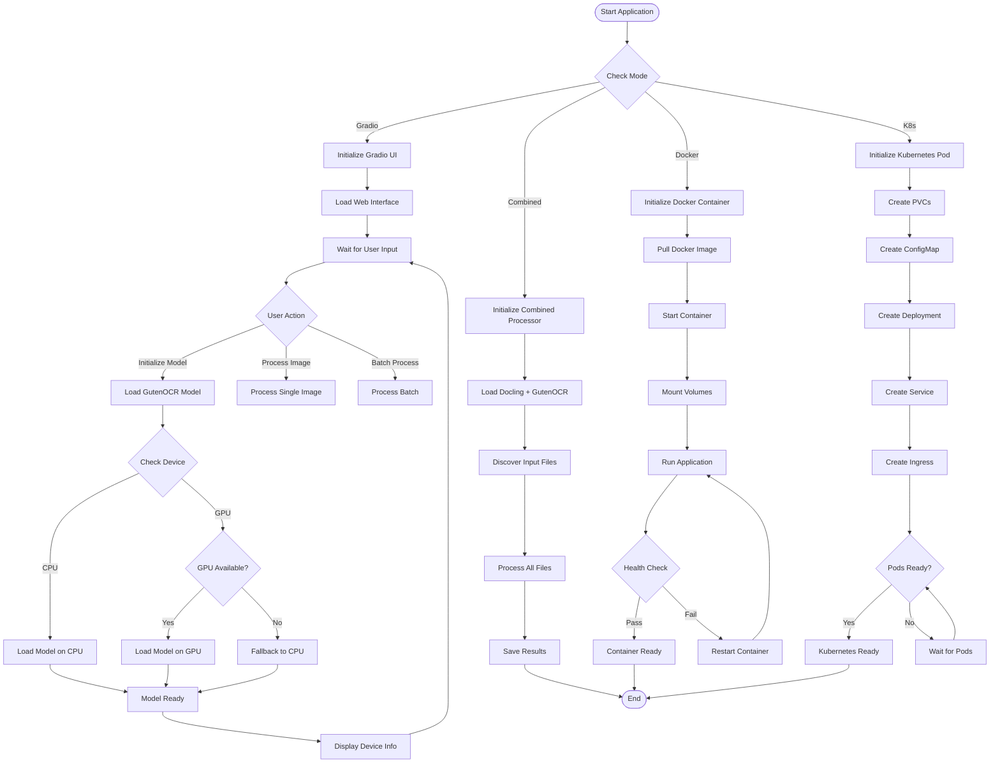
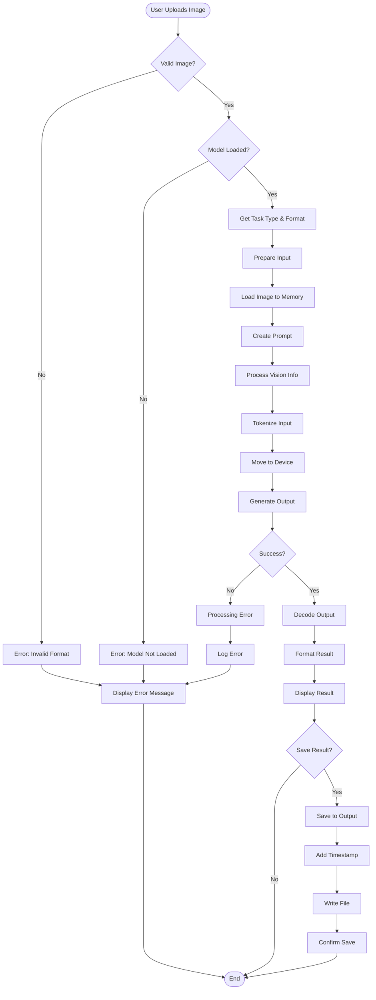
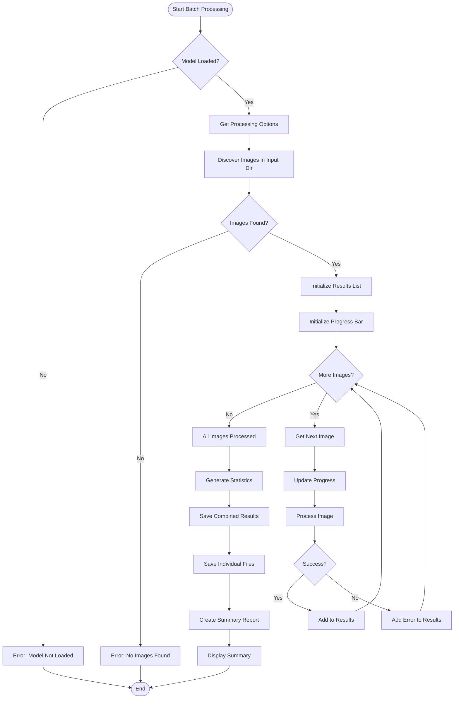
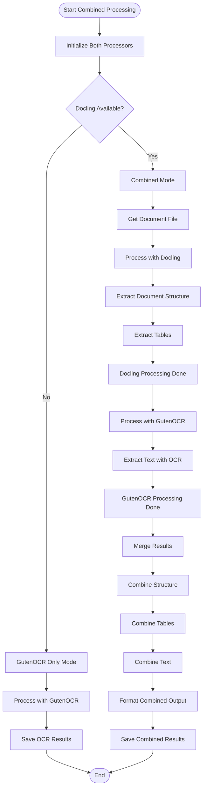
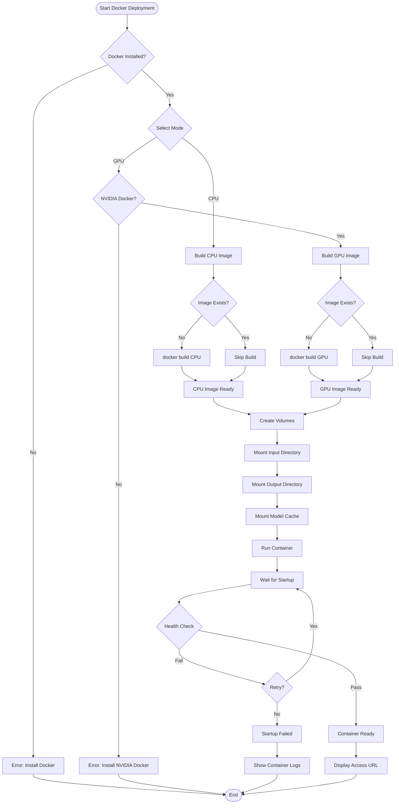
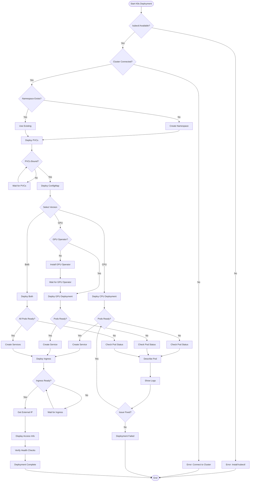
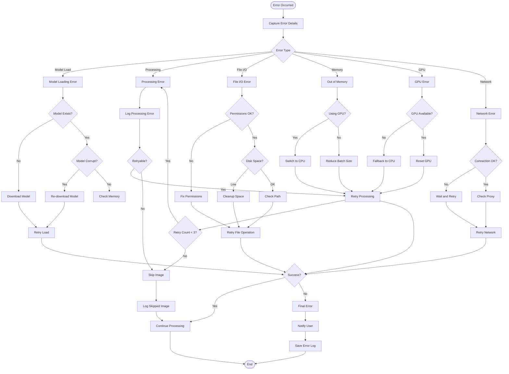
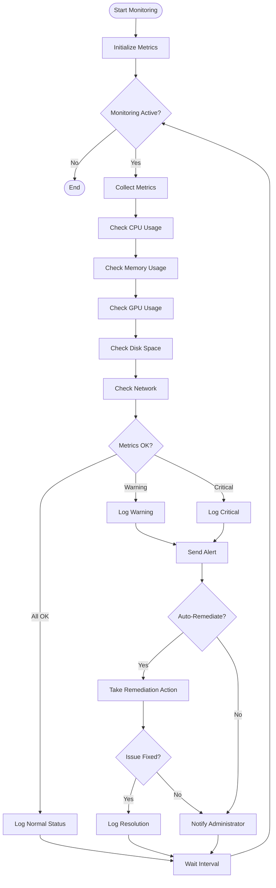

# GutenOCR Application Flow Charts

This document contains detailed Mermaid flow charts for the GutenOCR application.

## Table of Contents

1. [Application Startup Flow](#application-startup-flow)
2. [Single Image Processing Flow](#single-image-processing-flow)
3. [Batch Processing Flow](#batch-processing-flow)
4. [Combined Docling + GutenOCR Flow](#combined-docling--gutenocr-flow)
5. [Docker Deployment Flow](#docker-deployment-flow)
6. [Kubernetes Deployment Flow](#kubernetes-deployment-flow)
7. [Error Handling Flow](#error-handling-flow)

## Application Startup Flow

## Single Image Processing Flow

## Batch Processing Flow

## Combined Docling + GutenOCR Flow

## Docker Deployment Flow

## Kubernetes Deployment Flow

## Error Handling Flow

## System Health Monitoring Flow

---

**Note**: These flowcharts provide a comprehensive view of the GutenOCR application's operation. They can be rendered using any Mermaid-compatible viewer or documentation platform.